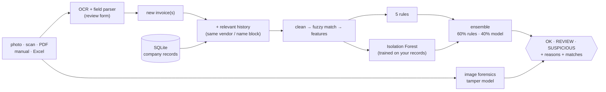

# Invoice Overpayment & Duplicate Payment Detection Engine

[](https://www.python.org/)
[](https://streamlit.io/)

**Check an invoice or receipt before you pay it.** Upload a photo, a scan, a PDF or an Excel batch. The engine
compares each one with your company's own payment history and tells you, in plain language, whether it looks like
something you've already paid, an amount far above what that vendor normally charges, or an image that may have been
edited.

| Verdict | Meaning | What to do |
|---|---|---|
| **OK** | Nothing matches an existing record; the amount is normal for this vendor | Pay as usual |
| **REVIEW** | Something is unusual but not conclusive (odd amount, image may be edited) | A person takes a second look |
| **SUSPICIOUS** | Strong evidence: duplicates a paid invoice, or is a clear overpayment | Hold the payment and investigate |

Every verdict comes with the reasons and the matching past records, so a reviewer can confirm it in seconds.

---

## The problem

Paying the same invoice twice, or paying more than you owe, is a common and hard-to-see way accounts-payable (AP)
teams lose money. It rarely looks like fraud; it looks like ordinary data.

| | |
|---|---|
| **Symptoms** | The same supplier invoice paid twice; payments far above a vendor's normal amount; reimbursements for edited receipts |
| **Root causes** | One invoice entered in several systems or by several people; formats differ (`SAP-2024-123456` vs `SAP2024123456`, "Acme Corp" vs "ACME CORPORATION LLC", dates a few days apart); nobody compares every invoice with each vendor's history; receipt images are easy to edit |
| **How it's handled today** | ERP duplicate checks that match exact fields; periodic manual sampling; after-the-fact recovery audits (see [COMPARISON](docs/COMPARISON.md)) |
| **Why that falls short** | Exact matching misses reformatted duplicates by construction; manual review doesn't scale; recovery audits act after the money is gone |
| **Consequences** | Direct cash loss, time spent chasing refunds from suppliers, audit findings |

## The solution

A local, explainable checker that matches the way a careful reviewer would: tolerant of formatting, aware of each
vendor's normal behaviour, and able to say why.

| Feature | Solves | Core / supporting |
|---|---|---|
| **Fuzzy duplicate matching** (reformatted numbers, name variants, dates within 7 days) | Duplicates that exact checks miss | Core |
| **Exact duplicate, overpayment, burst and round-number rules** | Clear-cut cases with auditable reasons | Core |
| **Anomaly model trained on your own history** (Isolation Forest) | Unusual payments no rule describes | Core |
| **Receipt intake**: photo/scan (OCR), PDF, manual form, Excel/CSV batch | Getting invoices in without retyping | Core |
| **Plain-language reasons + matching records** | Reviewers can act on a flag | Core |
| **Image-tamper score** | Possibly edited receipt images (weak; only asks for review) | Supporting |
| **Import from ERP exports** with loose column matching | Loading history without reformatting files | Supporting |
| **Full audit** of all records | Finding duplicates already paid | Supporting |
| **Check log** (`receipt_checks`) | Audit trail of every check | Supporting |

## Who it's for

| User | Use case | Value |
|---|---|---|
| AP clerk | Check invoices due this week (Excel batch) before the payment run | Duplicates and overpayments stopped before payment |
| Expense reviewer | Check a receipt photo attached to a claim | Resubmitted or edited receipts flagged |
| Finance controller / auditor | Run a full audit of historical payments | List of duplicates already paid, to recover |
| Developer / analyst | Tune thresholds, add rules, retrain | Transparent code and measured models |

**Use it** before releasing payments, for expense claims backed by receipt photos, in companies where invoices enter
through several systems or people, and for periodic audits of past payments.

**Don't use it** as proof of fraud (it prioritises what a human should check); without payment history (duplicate and
overpayment checks compare against your records); for mixed currencies without adding exchange rates (only
USD/EUR/GBP are converted); or as a public web app holding real invoices (there is no login yet).

---

## Quick start

```bash
pip install -r requirements.txt

# Load company history (CSV/Excel export). Columns are matched loosely: Invoice No, Supplier, Date, Total...
python -m intake.importer invoices_2024.xlsx       # --dayfirst for dd/mm/yyyy dates

#   ...or demo history from ~380 real scanned receipts (downloads a ~670 MB dataset once):
python -m forgery.dataset --history demo_history.csv
python -m intake.importer demo_history.csv

python pipeline.py                  # audit all records + train the anomaly model on them
python -m streamlit run app.py      # open http://localhost:8501
python tests/test_core.py           # optional: confirm the install (3 "ok" lines)
```

**In the app:** *Check receipt* (upload a photo/PDF or type the fields; correct anything OCR misread; **Check
authenticity**; **Add to company records** once paid) · *Batch check* (Excel/CSV, downloadable results) ·
*Import records* · *Records* (recent checks, highest-risk records) · sidebar **Audit records & train model**.

Required import columns: invoice number, vendor, date, amount. Recommended: vendor ID. Details, configuration and
the Python API: [docs/REFERENCE.md](docs/REFERENCE.md).

---

## How it works



A new invoice goes through exactly the same scoring as a historical one in a full audit, but only against the records
that can change its score, so checks stay fast (~2.5 s against 105K records). Full architecture, sequence diagrams and
design patterns: [docs/ARCHITECTURE.md](docs/ARCHITECTURE.md).

**Tech stack:** Python · pandas/NumPy · scikit-learn (Isolation Forest, random forest) · RapidFuzz (Levenshtein,
Jaro-Winkler) · RapidOCR on ONNX Runtime · pypdfium2 · Pillow · Streamlit · SQLite. Why each was chosen and what else
was considered: [ARCHITECTURE §7](docs/ARCHITECTURE.md#7-technology-stack) and [DECISIONS](docs/DECISIONS.md).

---

## Results and honest limitations

**Rules + anomaly model** on a labelled benchmark of 104,983 synthetic invoices with 5,758 planted anomalies:
**98.6% precision, 96.5% recall** (exact duplicates 100% recall, near duplicates 99.9%, overpayments 87.3%, bursts
100%). Fuzzy matching rejected 59.6% of amount/date-close candidate pairs as false duplicates.

> **These numbers are optimistic.** The anomalies were generated alongside the rules that detect them. Real accuracy
> needs a labelled sample of real payments; the audit reports it automatically when records carry `is_anomaly`.

**On real receipts:** with 377 genuine receipts loaded as history, the audit flags 6 as high risk, 4 of them the same
receipt recorded twice; re-uploading a receipt already on record is caught as a 100% duplicate.

**Image-tamper model** (held-out test set of real receipts): ROC-AUC 0.735, precision 36.8%, recall 40.0%. It catches
about 4 in 10 edited receipts and about 1 in 3 of its flags is real, so a tamper flag only ever asks for review.
Details, including an overfitting analysis: [docs/ML.md](docs/ML.md).

**Known limitations**
- No login, roles or multi-company separation: run inside a trusted network.
- Receipts carry vendor names, not IDs: same-name vendors merge; very different spellings become "new vendor".
- New vendors have no history, so only duplicate checks apply to them.
- OCR takes ~7–15 s per photo on a laptop CPU and sometimes misreads fields (hence the review form).
- SQLite: single writer; no migrations or backups built in; data is lost on hosts with ephemeral disks.
- The tamper model was trained on a research dataset of Malaysian retail receipts; check its terms before commercial use.
- Full list: [OPERATIONS](docs/OPERATIONS.md), [DATABASE §14](docs/DATABASE.md#14-known-discrepancies-and-debt).

---

## Deployment and security

Run it on a machine inside the company network (`python -m streamlit run app.py`); colleagues open
`http://<machine>:8501`. Streamlit Community Cloud works for a public demo with sample data only (its disk is wiped
on restart). There is no authentication and no encryption at rest or in transit; receipt images are processed in
memory and not stored. Details: [docs/OPERATIONS.md](docs/OPERATIONS.md).

---

## Roadmap

| Status | Item |
|---|---|
| Done | Company-history import (CSV/Excel), receipt checks (photo, PDF, manual, batch), per-company anomaly model, image-tamper model, check log |
| Done | Config fully wired; anomaly "unusual" flag limited to 1%; indexed history lookups; per-session DB connections |
| Planned | Login (OIDC) and roles; hosted Postgres with migrations; automated tests in CI; backups |
| Planned | Exchange-rate table for mixed currencies; fix known schema debts (unused column, default not applied) |
| Potential | HTTP API around `check_invoices`; ERP connectors and email-inbox intake; content checks for receipts (line items vs total); stronger tamper model with more forged training data |

---

## Documentation

| Document | Contents | Update when you change... |
|---|---|---|
| [ARCHITECTURE](docs/ARCHITECTURE.md) | Components, flows, sequence diagrams, patterns, tech stack | module layout, flows, dependencies |
| [DATABASE](docs/DATABASE.md) | ER diagram, schema, data dictionary, indexes, queries, transactions, lifecycle | `database/schema.sql`, any SQL, importer columns |
| [ML](docs/ML.md) | Rules, features, anomaly model, tamper model, OCR, evaluation | `detection/`, `forgery/`, `preprocessing/feature_engineer.py`, `intake/` |
| [REFERENCE](docs/REFERENCE.md) | CLI, Python API, environment variables, `config.py` | CLI arguments, public functions, `config.py` |
| [OPERATIONS](docs/OPERATIONS.md) | Install, troubleshooting, deployment, security, testing, observability, performance, failure handling | `requirements.txt`, `packages.txt`, `app.py`, tests |
| [DECISIONS](docs/DECISIONS.md) | Architecture decision records | any significant design choice |
| [COMPARISON](docs/COMPARISON.md) | Alternatives, with sources | positioning (re-verify sources yearly) |
| [GLOSSARY](docs/GLOSSARY.md) | Terms and acronyms | new concepts |

---

## Data and credits

- Receipt forgery data: *Find it again! A Receipt Dataset for Document Forgery Detection*, B. Martínez Tornés et al.,
  ICDAR 2023, L3i, University of La Rochelle, built on the SROIE receipts.
  [Dataset page](https://l3i-share.univ-lr.fr/2023Finditagain/index.html). Published for research.
- OCR: [RapidOCR](https://github.com/RapidAI/RapidOCR) (PaddleOCR models on ONNX Runtime).
- String similarity: [RapidFuzz](https://github.com/rapidfuzz/RapidFuzz). Models: [scikit-learn](https://scikit-learn.org/).

## License

No license file has been added yet, so all rights are reserved by the author by default.
