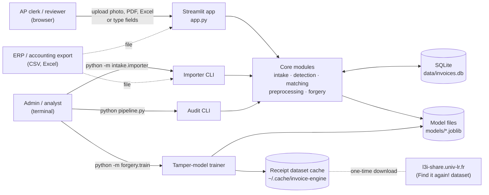
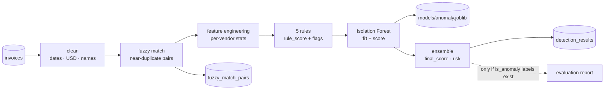
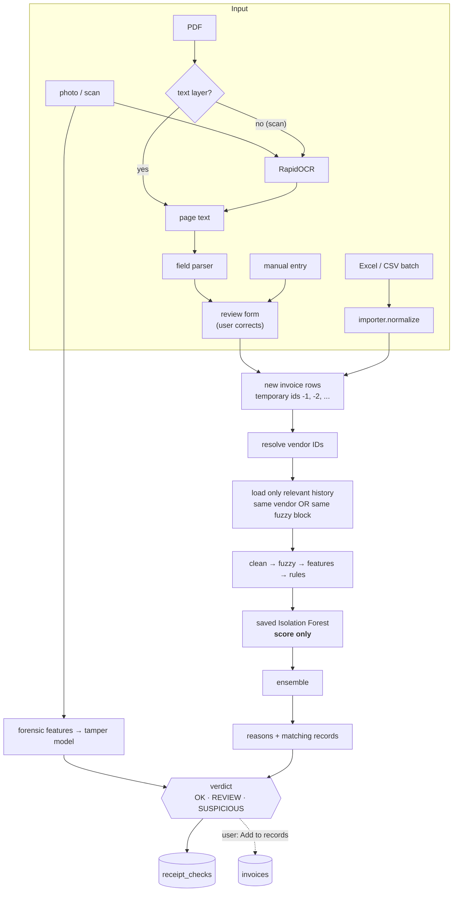

# Architecture

How the engine is put together, how data moves through it, and why it is built this way.
For the database see [DATABASE.md](DATABASE.md); for the models see [ML.md](ML.md); for the reasoning behind
major choices see [DECISIONS.md](DECISIONS.md).

---

## 1. System context

The engine is a **single-process Python application**: a Streamlit web UI and two command-line entry points that
share one set of modules and one SQLite file. There is no separate backend service, HTTP API, queue or cache, and it
makes **no calls to external services at runtime** (the only network access is the one-time download of the receipt
dataset used to train the tamper model).



**Not present (by design, for now):** authentication, multi-tenancy, HTTP/REST API, background workers, message
queues, caches beyond in-process memoization, containerization, CI/CD. See [Roadmap](../README.md#roadmap).

---

## 2. Components

| Layer | Module | Responsibility | Why it exists |
|---|---|---|---|
| Presentation | `app.py` | Streamlit UI: check a receipt, batch check, import, browse records, retrain | Non-technical users need upload-and-read, not a terminal |
| Orchestration | `pipeline.py` (`run_audit`) | Flow A: score every record, train and save the anomaly model, write results | Periodic full audit + the only place the model is trained |
| | `detection/checker.py` (`check_invoices`) | Flow B: score new invoices against history, build reasons, verdicts | Checking before payment is the product's core job |
| Intake | `intake/importer.py` | CSV/Excel → normalized rows; column aliasing; vendor-ID resolution; insert | ERP exports never share a column layout |
| | `intake/ocr.py` | Image → text (RapidOCR), PDF → text layer or OCR | Receipts arrive as pictures |
| | `intake/fields.py` | Text → vendor, invoice no., date, total, currency | Turns OCR text into the fields the checks need |
| Preprocessing | `preprocessing/cleaner.py` | Date parsing, USD conversion, vendor-name normalization | Same vendor, many spellings; several currencies |
| | `preprocessing/feature_engineer.py` | Per-vendor statistics (z-score, ratios, frequency, gaps, repeats) | "Unusual" only means something relative to a vendor's history |
| Matching | `matching/fuzzy_matcher.py` | Near-duplicate pairs via blocking + Levenshtein/Jaro-Winkler | Exact matching misses reformatted duplicates |
| Detection | `detection/rule_engine.py` | Five business rules → rule score + flags | Explainable, auditable decisions |
| | `detection/ml_detector.py` | Isolation Forest: fit / score / save / load | Catches patterns rules don't describe |
| | `detection/ensemble.py` | Blend rule + model scores → risk category, combined flags | One number and one verdict per invoice |
| | `forgery/model.py` | Image forensic features + tamper probability | Edited receipts look normal as data |
| Training | `forgery/dataset.py`, `forgery/train.py` | Dataset download/extract, demo history, tamper-model training | Reproducible model build |
| Evaluation | `evaluation/metrics.py` | Precision/recall/F1 when labels exist | Measure, don't assume |
| Persistence | `database/db_manager.py`, `database/schema.sql` | SQLite connection, schema, reads/writes | Durable records, results, check log |
| Config | `config.py` | Paths, thresholds, weights (every value is used; see [REFERENCE.md](REFERENCE.md#3-configuration)) | One place to tune |

The app opens **one SQLite connection per browser session** (`app.get_db`), so concurrent users never share a connection.

---

## 3. The two flows

Both flows run the **same scoring chain** so their results always agree. Flow A trains; flow B only scores.

### Flow A: audit (`python pipeline.py` or the sidebar button)



### Flow B: check (`app.py` → `detection/checker.py`)



**Relevant-history optimization.** A new invoice's score depends only on (a) its own vendor's rows (statistics, exact
duplicates) and (b) rows in the same fuzzy-matching block (near duplicates). `_relevant_history` loads just those
rows. Results are identical to using the full history (verified), and a check against 105K records takes ~2.5 s
instead of ~8.7 s.

**Orientation fix.** The fuzzy matcher marks the *later-dated* invoice of a pair as the duplicate. When checking, the
new invoice is always the suspect, so pairs are re-oriented so the new row is `record_b`.

---

## 4. Sequence: checking one receipt photo

Normal flow, plus the main degraded paths.

```mermaid
sequenceDiagram
    actor U as Reviewer
    participant A as Streamlit app
    participant O as intake.ocr / fields
    participant C as detection.checker
    participant DB as SQLite
    participant M as models/*.joblib

    U->>A: upload receipt.png
    A->>O: extract(name, bytes)
    O-->>A: text, image, tamper_checkable=true
    A->>O: parse_fields(text)
    O-->>A: vendor, invoice no., date, total, currency
    A-->>U: pre-filled form + raw text
    U->>A: correct fields, "Check authenticity"
    A->>C: check_invoices(row)
    C->>DB: vendors; relevant history
    DB-->>C: rows
    C->>M: load anomaly model (cached per file mtime)
    C-->>A: risk, score, flags, reasons, matches
    A->>M: tamper_score(image)
    M-->>A: probability, flagged
    A->>DB: INSERT receipt_checks
    A-->>U: verdict + reasons + matching records
    opt approved and paid
        U->>A: "Add to company records"
        A->>DB: INSERT vendors (ignore existing), invoices
    end

    Note over O,A: OCR finds nothing → empty form, user types fields
    Note over C,M: no anomaly model yet → rules only (ml_score = 0)
    Note over A,M: no tamper model or PDF input → tamper "n/a"
```

---

## 5. Data flow and transformations

| Step | Input | Transformation | Output | Persisted? |
|---|---|---|---|---|
| Import | CSV/Excel | header aliasing, amount/date coercion, invalid rows dropped, vendor IDs resolved | invoice rows | `vendors`, `invoices` |
| OCR | image bytes / PDF | text detection + recognition; boxes regrouped into lines | text | no (uploads are processed in memory) |
| Field parsing | text | regex heuristics for total, date, IDs, currency; business-name heuristic for vendor | 5 fields | no |
| Cleaning | rows | dates → datetime, `amount_usd`, `vendor_name_clean` | enriched rows | no |
| Fuzzy matching | rows | blocking, windowing, similarity scoring | pairs + per-invoice max score | `fuzzy_match_pairs` (audit only) |
| Features | rows | per-vendor aggregates | 7 feature columns | no |
| Rules | rows + pairs | 5 rule scores → max, flag names | `rule_score`, `rule_flags` | via `detection_results` |
| Model | features | scaled → Isolation Forest | `ml_score`, `ml_prediction` | model file (audit) |
| Ensemble | scores | weighted blend, floor, thresholds | `final_score`, `risk_category`, `all_flags` | `detection_results` (audit) |
| Verdict | risk + tamper flag | HIGH→SUSPICIOUS; MEDIUM or tamper→REVIEW | verdict + reasons | `receipt_checks` (check) |

---

## 6. Project structure and patterns

```
projecttt/
├── app.py                      # Presentation: Streamlit UI (tabs, session state, caching)
├── pipeline.py                 # Orchestration: flow A (audit + train)
├── config.py                   # Configuration constants
├── intake/                     # Getting data in
│   ├── importer.py             #   CSV/Excel import + vendor-ID resolution (also a CLI)
│   ├── ocr.py                  #   image/PDF → text
│   └── fields.py               #   text → invoice fields
├── preprocessing/              # Shaping data
│   ├── cleaner.py              #   normalization
│   └── feature_engineer.py     #   per-vendor features
├── matching/fuzzy_matcher.py   # Near-duplicate detection
├── detection/                  # Deciding
│   ├── checker.py              #   flow B (check new invoices)
│   ├── rule_engine.py          #   5 rules
│   ├── ml_detector.py          #   Isolation Forest wrapper
│   └── ensemble.py             #   blend + risk category
├── forgery/                    # Image-tamper model
│   ├── dataset.py              #   dataset download + demo history (also a CLI)
│   ├── model.py                #   features + scoring
│   └── train.py                #   training + evaluation (CLI)
├── evaluation/metrics.py       # Precision / recall / F1
├── database/                   # Persistence
│   ├── schema.sql
│   └── db_manager.py
├── models/tamper.joblib        # Shipped model (anomaly.joblib is created per company, git-ignored)
├── tests/test_core.py          # Smoke tests
├── docs/                       # This documentation
├── requirements.txt            # Python dependencies
└── packages.txt                # System libraries for Streamlit Community Cloud
```

**Patterns in use**
- **Pipeline / pipes-and-filters:** each stage is a function `DataFrame → DataFrame` that adds columns
  (`clean_invoice_data`, `engineer_features`, `apply_all_rules`, `detect_anomalies`, `run_ensemble`). Stages are
  composed in `pipeline.py` and `checker.py`.
- **Shared kernel:** audit and check call the same stage functions, so there is one definition of "duplicate",
  "overpayment" and "risk".
- **Fit/score separation:** `MLDetector.fit` (audit) and `MLDetector.score` (check) with the fitted state persisted
  via joblib: train offline, score online.
- **Thin UI:** `app.py` holds no detection logic; it calls `intake`, `detection` and `forgery` functions.
- **Separation of concerns:** intake knows file formats, preprocessing knows data shape, detection knows risk,
  database knows SQL. Only `database/` and two query helpers (`checker._relevant_history`, app's read-only views)
  contain SQL.

---

## 7. Technology stack

| Technology | Responsibility | Why chosen | Alternatives considered |
|---|---|---|---|
| **Python 3.10+** | Everything | Data/ML ecosystem; one language end to end | — |
| **pandas / NumPy** | Tabular transforms, vectorized features and rules | Invoices are tables; vectorized ops keep a 105K audit ~15 s | Polars (faster, but the codebase and sklearn integration are pandas-native) |
| **scikit-learn** | Isolation Forest, random forest, scaling, metrics | Mature, CPU-only, small model files | PyOD (more detectors, extra dependency); XGBoost (not needed at this data size) |
| **RapidFuzz** | Levenshtein, Jaro-Winkler, vendor-name matching | C++-backed, much faster than pure-Python fuzzy libraries | python-Levenshtein, thefuzz |
| **RapidOCR + ONNX Runtime** | OCR of receipt images | Pip-only (no system install), runs on CPU, good on printed receipts | Tesseract (needs a system binary), EasyOCR/PaddleOCR (heavy PyTorch/Paddle), cloud OCR or LLM vision (data leaves the machine, per-call cost) |
| **pypdfium2** | PDF text extraction and page rendering | One wheel does both; no system dependencies | pypdf (text only), PyMuPDF (AGPL licence) |
| **Pillow** | Image loading, JPEG re-compression (ELA), median filter | Standard, sufficient for classical forensics | OpenCV (heavier; not needed for these operations) |
| **openpyxl** | Reading `.xlsx` via pandas | pandas' default Excel engine | calamine |
| **Streamlit** | Web UI | Data app in pure Python; file upload, forms, tables built in; free hosting option | FastAPI + React (more control, far more code), Gradio (ML-demo oriented) |
| **SQLite** | Records, results, check log | Zero setup, single file, transactional, fast for one company's data | PostgreSQL (planned for multi-user/cloud; see [DATABASE.md](DATABASE.md#13-why-sqlite-trade-offs)) |
| **joblib** | Model persistence | sklearn's standard serializer | ONNX export (portable, more work), pickle |
