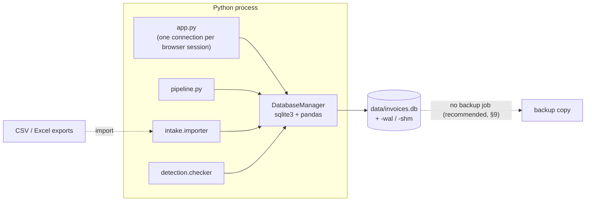

# Database

Everything about the data layer: what is stored, why SQLite, how the schema is used, and what to watch when changing
it. Facts here were checked against `database/schema.sql`, `database/db_manager.py`, the code that issues queries,
and a read-only introspection of `data/invoices.db` (SQLite 3.50.4, WAL mode, 4 KB pages).

---

## 1. Overview

| | |
|---|---|
| **Engine** | SQLite 3 (bundled with Python's `sqlite3`); tested with SQLite 3.50.4 |
| **File** | `data/invoices.db` (override with env var `INVOICE_DB_PATH`); git-ignored because it holds company data |
| **Mode** | `PRAGMA journal_mode=WAL`, `PRAGMA foreign_keys=ON`, `PRAGMA cache_size=-65536` (64 MB), set per connection in `DatabaseManager._connect` |
| **Schema** | `database/schema.sql`, applied by `DatabaseManager.init_db()` with `CREATE TABLE/INDEX IF NOT EXISTS` |
| **Access layer** | `DatabaseManager` (thin wrapper) + pandas `read_sql_query` / `to_sql`; no ORM |
| **Other storage** | Model files in `models/` (joblib) and the receipt dataset cache in `~/.cache/invoice-engine` are files, not database objects (see [§12](#12-storage-outside-the-database)) |

### Database architecture

No connection pool, cache, replica or server process exists; SQLite is an in-process library.

---

## 2. ER diagram

Relationships below are the **actual foreign keys** in the schema. `receipt_checks` intentionally has none (a checked
receipt may never become a record).

```mermaid
erDiagram
    VENDORS ||--o{ INVOICES : "vendor_id"
    INVOICES ||--o{ DETECTION_RESULTS : "invoice_row_id"
    INVOICES ||--o{ FUZZY_MATCH_PAIRS : "record_a_id (original)"
    INVOICES ||--o{ FUZZY_MATCH_PAIRS : "record_b_id (duplicate)"

    VENDORS {
        TEXT vendor_id PK
        TEXT vendor_name "NOT NULL"
        TEXT vendor_name_normalized
        TEXT erp_source
    }
    INVOICES {
        INTEGER id PK "autoincrement"
        TEXT invoice_id "NOT NULL, vendor's invoice number"
        TEXT vendor_id FK "NOT NULL"
        TEXT vendor_name "NOT NULL"
        TEXT invoice_date "NOT NULL, ISO yyyy-mm-dd"
        TEXT due_date
        REAL amount "NOT NULL"
        TEXT currency "DEFAULT USD"
        TEXT department
        TEXT po_number
        TEXT payment_status "DEFAULT pending"
        TEXT erp_source
        INTEGER is_anomaly "optional label"
        TEXT anomaly_type "optional label"
        TEXT source "import file name"
        TEXT imported_at "DEFAULT CURRENT_TIMESTAMP"
    }
    DETECTION_RESULTS {
        INTEGER id PK
        INTEGER invoice_row_id FK "NOT NULL"
        REAL rule_score
        REAL ml_score
        REAL final_score
        TEXT risk_category "HIGH, MEDIUM, LOW"
        TEXT flags
        TEXT detected_at "DEFAULT CURRENT_TIMESTAMP"
    }
    FUZZY_MATCH_PAIRS {
        INTEGER id PK
        INTEGER record_a_id FK "NOT NULL"
        INTEGER record_b_id FK "NOT NULL"
        REAL similarity_score "NOT NULL"
        REAL levenshtein_score
        REAL jaro_winkler_score
        TEXT match_type "cross_erp_id, vendor_variant"
    }
    RECEIPT_CHECKS {
        INTEGER id PK
        TEXT checked_at "DEFAULT CURRENT_TIMESTAMP"
        TEXT source "Photo / scan, PDF, Manual entry, excel"
        TEXT file_name
        TEXT invoice_id
        TEXT vendor_name
        TEXT invoice_date
        REAL amount
        TEXT currency
        REAL final_score
        TEXT risk_category
        TEXT flags
        REAL tamper_score
        TEXT verdict "OK, REVIEW, SUSPICIOUS"
    }
```

### Relationships and cardinality

| Relationship | Cardinality | Enforced? | Notes |
|---|---|---|---|
| `vendors` → `invoices` | 1 : 0..N | FK, `ON DELETE NO ACTION` | Importer always inserts the vendor first (`INSERT OR IGNORE`), so every invoice has a vendor |
| `invoices` → `detection_results` | 1 : 0..N in the schema, **1 : 0..1 in practice** | FK | Each audit deletes all results and writes one row per invoice. No `UNIQUE(invoice_row_id)`, so the 1:1 relies on that replace |
| `invoices` → `fuzzy_match_pairs` | 1 : 0..N, twice | 2 FKs | A pair links an original (`record_a_id`, earlier date) and a duplicate (`record_b_id`). Self-referencing many-to-many through this table |
| `receipt_checks` | none | — | Logged checks keep their own copy of the fields; saving a check as a record copies it into `invoices` |

**No cascading deletes.** Deleting an invoice that has results or pairs fails while `foreign_keys=ON`; delete dependents
first (or re-run an audit, which replaces them).

**Deliberately absent: `UNIQUE(vendor_id, invoice_id)` on `invoices`.** Storing duplicates is the point: the audit must
be able to find an invoice that was entered twice.

---

## 3. Tables

### `vendors`
Suppliers seen in imported records. One row per `vendor_id`, holding the first name seen for it.
- Written by `intake.importer.import_records` via `INSERT OR IGNORE` (existing IDs are never changed).
- Read by `resolve_vendor_ids` (name → ID) in the importer and the checker.

### `invoices`
The company's payment history: the reference everything is checked against.
- Written by the importer (CLI, Import tab) and by **Add to company records** after a check.
- Read by the audit (all rows) and by the checker (only relevant rows, [§6](#6-important-queries)).
- `is_anomaly` / `anomaly_type` are optional ground-truth labels; `NULL` is the normal case. When some rows are
  labelled, the audit prints precision/recall on them.

### `detection_results`
The latest audit's verdict for every invoice (`final_score`, `risk_category`, `flags`). Replaced as a whole by each
audit; read by the Records tab.

### `fuzzy_match_pairs`
Near-duplicate pairs confirmed by the latest audit. Replaced as a whole by each audit. Checks do **not** write here;
their matches are returned in memory and summarised in the reasons.

### `receipt_checks`
Append-only log of every check made in the app (single and batch), with the verdict. Serves as the audit trail and
feeds the Records tab. There is no user column yet (no login).

---

## 4. Data dictionary

Sensitivity: **C** = confidential business data (who the company pays, how much), **I** = internal, **P** = public/none.

| Table.field | Type | Constraints | Description | Example | Sens. |
|---|---|---|---|---|---|
| vendors.vendor_id | TEXT | PK | Vendor code from the ERP, or a slug made from the normalized name | `V-0085`, `V-ACME-SUPPLIES` | I |
| vendors.vendor_name | TEXT | NOT NULL | First name seen for the vendor | `Acme Supplies Ltd` | C |
| vendors.vendor_name_normalized | TEXT | | Lower-case name without punctuation/suffixes. Written, currently not read | `acme supplies` | C |
| vendors.erp_source | TEXT | | Source system, if provided | `SAP` | I |
| invoices.id | INTEGER | PK, autoincrement | Internal record ID shown as `record #…` in reasons | `54` | I |
| invoices.invoice_id | TEXT | NOT NULL, indexed | Vendor's invoice/receipt number as written | `CS00012944` | C |
| invoices.vendor_id | TEXT | NOT NULL, FK, indexed | → vendors | `V-0085` | I |
| invoices.vendor_name | TEXT | NOT NULL, indexed | Vendor name as written on this invoice (variants kept) | `ACME SUPPLIES` | C |
| invoices.invoice_date | TEXT | NOT NULL, indexed | ISO date | `2018-01-25` | C |
| invoices.due_date | TEXT | | ISO date | `2018-02-24` | C |
| invoices.amount | REAL | NOT NULL, indexed | Amount in `currency` | `190.8` | C |
| invoices.currency | TEXT | DEFAULT `USD` | ISO code; USD/EUR/GBP are converted for comparison, others compared as-is | `MYR` | I |
| invoices.department, po_number, payment_status, erp_source | TEXT | | Optional context; `po_number` enables the burst rule | `PO-554120` | C |
| invoices.is_anomaly | INTEGER | | Optional label: 1 known bad, 0 known good, NULL unknown | `NULL` | I |
| invoices.anomaly_type | TEXT | | Optional label | `exact_duplicate` | I |
| invoices.source | TEXT | | File the row was imported from, or `receipt-check` / `batch-check` | `invoices_2024.xlsx` | I |
| invoices.imported_at | TEXT | DEFAULT now | UTC timestamp | `2026-10-01 03:03:08` | I |
| detection_results.* | | FK → invoices | `rule_score`, `ml_score`, `final_score` in 0–1; `risk_category`; comma-joined `flags` | `0.88`, `HIGH`, `exact_dup` | I |
| fuzzy_match_pairs.* | | FKs → invoices | Pair IDs, similarity scores, `match_type` | `cross_erp_id` | I |
| receipt_checks.* | | | Copy of the checked fields plus scores and `verdict`; `file_name` is `<name>-<size>` of the upload | `SUSPICIOUS` | C |

No personal data about individuals is stored by design, but receipts can carry people's names (e.g. a cashier or a
handwritten note) that OCR may copy into `vendor_name`.

---

## 5. Indexes

| Index | Column(s) | Serves | Verified plan |
|---|---|---|---|
| `sqlite_autoindex_vendors_1` | vendors.vendor_id (PK) | `INSERT OR IGNORE` conflict check; FK checks | — |
| `idx_invoices_vendor_id` | invoices.vendor_id | Checker history lookup (vendor side); FK checks on insert | `SEARCH … USING INDEX idx_invoices_vendor_id` |
| `idx_invoices_vendor_name` | invoices.vendor_name | Checker history lookup (name side); `SELECT DISTINCT vendor_name` | `MULTI-INDEX OR` together with the index above; `SCAN … USING COVERING INDEX` for DISTINCT |
| `idx_invoices_invoice_id` | invoices.invoice_id | Ad-hoc lookups by invoice number | — |
| `idx_invoices_invoice_date` | invoices.invoice_date | Ad-hoc date-range queries | — (no current code path) |
| `idx_invoices_amount` | invoices.amount | Ad-hoc amount queries | — (no current code path) |
| `idx_detection_results_invoice` | detection_results.invoice_row_id | FK checks; joins from invoices | — |

Before `idx_invoices_vendor_name` existed, the checker's `vendor_id IN (…) OR vendor_name IN (…)` query was a full
table scan (verified with `EXPLAIN QUERY PLAN`).

**Write cost.** Indexes slow bulk imports: inserting 105K invoices took 7.8 s with SQLite's default 2 MB page cache and
2.6 s with the 64 MB cache the manager sets. Dropping and re-creating indexes around very large imports is faster still
(1.9 s measured) but not implemented.

---

## 6. Important queries

| Where | Query (simplified) | Notes |
|---|---|---|
| `DatabaseManager.get_all_invoices` | `SELECT * FROM invoices` | Audit loads everything; ~2 s for 105K rows |
| `checker._relevant_history` | `SELECT DISTINCT vendor_name FROM invoices`, then `SELECT * FROM invoices WHERE vendor_id IN (?…) OR vendor_name IN (?…)` | Loads only rows that can affect the new invoices' scores: same vendor, or same fuzzy-matching block. Parameterized. One `IN` list is bounded by SQLite's 32,766-parameter limit (fine for one company's vendor names) |
| importer / checker | `SELECT vendor_id, vendor_name FROM vendors` | Full scan; small table |
| `write_detection_results`, `write_fuzzy_matches` | `DELETE FROM …` then bulk insert | Replace semantics, one transaction each (§7) |
| app, Records tab | `detection_results JOIN invoices … WHERE risk_category != 'LOW' ORDER BY final_score DESC LIMIT 500` | Scans results + temp B-tree sort; fine at company scale |
| app, Records tab | `SELECT … FROM receipt_checks ORDER BY id DESC LIMIT 200`; `SELECT * FROM invoices ORDER BY id DESC LIMIT 1000` | Rowid order, no sort |

All queries that include user-supplied values use bound parameters; the only f-string SQL builds the `?` placeholder
list itself, never values.

---

## 7. Transactions and integrity

| Operation | Boundary | Behaviour on failure |
|---|---|---|
| Import (`import_records`) | **Two** transactions: vendors (`with conn:` + `INSERT OR IGNORE`), then invoices (`to_sql`) | If the invoice insert fails, new vendor rows remain (harmless: unused vendors). Invoices are all-or-nothing |
| Audit write | `DELETE FROM detection_results` + insert run on one connection; pandas' `run_transaction` commits both or rolls both back | Previous results survive a failed write |
| Check log (`log_receipt_check`) | One insert per check | — |
| Add to records | Same as import | — |

- **Isolation:** SQLite serializes writers; WAL lets readers continue during a write. Python's default 5-second busy
  timeout applies if two writers collide (e.g. an audit and an import at the same moment); after that the write fails
  with `database is locked`.
- **Concurrency in the app:** one connection per browser session (`app.get_db`). Model training during an audit is
  in-process and blocks that session only.
- **Integrity rules in code, not schema:** required fields, amount/date parsing and vendor-ID assignment happen in
  `intake.importer.normalize`; the schema has no `CHECK` constraints.

---

## 8. Schema changes and migrations

**No migration tool.** `init_db()` runs `schema.sql`, whose `CREATE … IF NOT EXISTS` statements add missing tables and
indexes but **never alter existing tables**.

> **Warning.** Databases created before the current schema are not upgraded. For example, a database from the earlier
> synthetic-data version has `due_date NOT NULL` and `is_anomaly DEFAULT 0`, and no `source`/`imported_at` columns;
> imports into it fail or behave differently.

Safe procedure for a schema change today:
1. Edit `database/schema.sql` (new tables/indexes: nothing else needed).
2. For changes to existing tables, write the `ALTER TABLE` (SQLite supports `ADD COLUMN`, `RENAME COLUMN`,
   `DROP COLUMN`) or, for anything else, create-copy-rename, and run it once against each database; back up first.
3. Update this document, the data dictionary and `INVOICE_COLUMNS` in `intake/importer.py` if columns change.

Adopting a migration tool (e.g. Alembic with SQLAlchemy) belongs with the planned Postgres move.

---

## 9. Backup and recovery

**Not implemented.** Recommended:
- Stop the app (or rely on WAL) and copy with SQLite's online backup, e.g.
  `python -c "import sqlite3; sqlite3.connect('data/invoices.db').backup(sqlite3.connect('backup.db'))"`.
- Keep daily copies for as long as payment records must be retained.
- Restore = replace `data/invoices.db` with the copy (delete stale `-wal`/`-shm` files), then re-run the audit to
  rebuild results and the anomaly model.

> **Cloud-sync folders.** If the project sits in OneDrive/Dropbox, the database file is synced to that cloud (a data
> location to be aware of) and sync conflicts can corrupt or roll back an open SQLite file. Keep `INVOICE_DB_PATH`
> outside synced folders for real data.

---

## 10. Data lifecycle

| Stage | Where | Detail |
|---|---|---|
| Create | Import (CLI/tab), **Add to company records** | Required: invoice number, vendor, date, amount |
| Validate | `importer.normalize` | Header aliasing; amounts stripped of symbols; dates parsed (`--dayfirst` option); rows missing any required field are skipped and counted |
| Store | `vendors`, `invoices` | Vendor ID assigned: given ID → exact normalized name → ≥90% similar name → one name containing the other (15+ chars) → new slug |
| Read | Audit (all), check (relevant subset), Records tab | |
| Update | None | Records are never updated in place; results tables are replaced per audit |
| Archive/Delete | None built in | Hard delete by hand (SQL) respecting FKs; no soft delete, no retention policy |

---

## 11. Database-to-application mapping

| Table | Written by | Read by | Surfaced in |
|---|---|---|---|
| vendors | `importer.import_records` | `importer.resolve_vendor_ids`, `checker.check_invoices` | Vendor IDs in results |
| invoices | `importer.import_records`, `checker.add_to_records` | `pipeline.run_audit`, `checker._relevant_history`, app | Matching records, Records tab |
| detection_results | `pipeline.run_audit` | app (Records tab) | "Highest-risk records" |
| fuzzy_match_pairs | `pipeline.run_audit` | nothing in code yet (ad-hoc SQL) | — |
| receipt_checks | app (`log_receipt_check`) | app (Records tab) | "Recent checks" |

---

## 12. Storage outside the database

| Store | Content | Lifecycle |
|---|---|---|
| `models/anomaly.joblib` | Isolation Forest + scaler trained on this company's records | Overwritten by every audit; git-ignored |
| `models/tamper.joblib` | Image-tamper random forest + threshold + test metrics | Built by `python -m forgery.train`; committed |
| `~/.cache/invoice-engine/` (`INVOICE_DATA_DIR`) | Receipt dataset zip, extracted images, feature caches, demo history CSV | Created on first training/demo run; safe to delete |

---

## 13. Why SQLite (trade-offs)

| | SQLite (current) | PostgreSQL (planned) |
|---|---|---|
| Setup | None; a file | Server or managed service |
| Fit | One company, one machine, a few concurrent users | Many users, several app instances, cloud hosting |
| Concurrency | Many readers, one writer at a time | Row-level locking, many writers |
| Cloud hosting | Lost on hosts with ephemeral disks (e.g. Streamlit Community Cloud) | Persistent |
| Ops | Copy a file to back up | Backups/replicas via the provider |

SQLite was chosen because the product's first deployment target is a single company running it locally, where zero
setup and data never leaving the machine matter more than write concurrency. The code touches SQL in only
`database/db_manager.py` and `detection/checker._relevant_history`, which bounds the Postgres migration effort.

---

## 14. Known discrepancies and debt

- `vendors.vendor_name_normalized` is written but never read (vendor matching recomputes normalized names).
- `invoices.payment_status DEFAULT 'pending'` never applies: the importer inserts an explicit `NULL`.
- `detection_results` relies on replace-per-audit for its 1:1 with invoices (no `UNIQUE` constraint).
- Foreign keys are enforced only on connections that run `PRAGMA foreign_keys=ON` (the manager does; external tools
  opening the file usually don't).
- Demo history parsing labels a few Malaysian receipts `USD`/`INR` because of `$`/`Rs` symbols on them.
- No migrations, no backups, no retention policy (see §8–§10).
