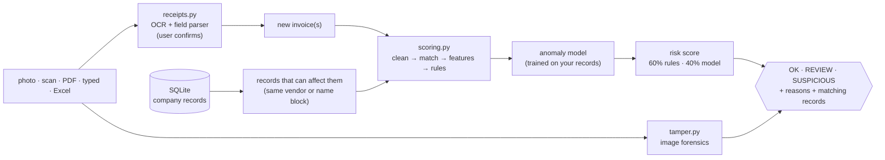

# How it works

For developers and reviewers. Usage is in the [README](../README.md).

## Flow

A **check** (`checks.check`) and a full **audit** (`checks.audit`) run the same scoring. A check loads only the
records that can change the new invoices' scores (same vendor ID, or the same 3-letter vendor-name block), which gives
the same result as scoring against everything and takes ~2.5 s against 100K records.

## Scoring (`engine/scoring.py`)

1. **Clean:** dates parsed; amounts converted to USD (`USD_RATES`); vendor names normalized (`ACME Corp., LLC` → `acme`).
2. **Near-duplicate matching:** invoices are grouped by the first 3 letters of the normalized vendor name, then sorted by
   amount. Candidate pairs have amounts within 0.5% (+0.01) and dates within 7 days. A candidate pair is confirmed when:
   - the vendor is the same and the invoice numbers are equal after removing dashes and spaces, or at least 85% similar (Levenshtein); or
   - the vendor names are at least 85% similar (0.4 × Levenshtein + 0.6 × Jaro-Winkler; at least 90% across different vendor IDs) **and** the
     invoice numbers are at least 70% similar.

   The later invoice is the duplicate. In a check, the new invoice is always the duplicate.
3. **Features per vendor:** z-score, amount ÷ median, amount ÷ max, invoices in the same calendar month, days since
   the previous invoice, count of the same amount, best near-duplicate similarity.
4. **Rules:** see the table in the README. Each scores 0–1, and `rule_score` is the highest of them.
5. **Anomaly model:** see below. `ml_score` is 0–1.
6. **Risk score:** `0.6 × rule_score + 0.4 × ml_score`. A rule hit ≥ 0.80 lifts it to at least 0.88. Scores ≥ 0.7 are
   **HIGH** (SUSPICIOUS) and ≥ 0.4 are **MEDIUM** (REVIEW). The model's maximum contribution is 0.4, so **the model alone can
   never make an invoice SUSPICIOUS**. An image-tamper flag alone only gives REVIEW.

## Anomaly model (Isolation Forest)

- **Why:** company histories are unlabelled, so nobody knows which past payments were wrong. Isolation Forest needs no labels, trains
  in seconds on 100K rows, and measures how quickly random splits isolate an invoice.
- **Training:** each audit refits it on all records: 8 standardized features, 200 trees, `random_state=42`. The
  "unusual" cutoff marks the most unusual 1% of the history. That cutoff only adds a flag and a reason. It changes neither the score nor
  the verdict.
- **Not trained** on fewer than `MIN_RECORDS_FOR_MODEL` (50) records. With so little history it would learn noise, so
  checks use rules only until there is more.
- **Saved** as a plain dict (scaler, forest, cutoff, score range) in `models/anomaly.joblib`. That file is per company and is
  never committed.

## Image-tamper model (`engine/tamper.py`)

- **Features (17 per image):** error-level analysis (re-save as JPEG at quality 90, then diff) and a noise residual (image minus its
  3×3 median), summarized per 32×32 block over text areas only (mean, std, median, p95, max, max/median, share of
  outlier blocks), plus text-area share and global ELA/noise means.
- **Data:** *Find it again!* has 988 real receipt scans, 163 of them forged, with official train/val/test splits (577/192/218).
- **Training** (`python cli.py train-tamper`): logistic regression on train+val. The decision threshold is the best F1 on
  5-fold **out-of-fold** predictions. The test split is used only for the final report.

| | Train ROC-AUC | 5-fold CV ROC-AUC | Test ROC-AUC | Test precision | Test recall |
|---|---|---|---|---|---|
| Previous random forest (500 trees, leaf 2) | **0.999** | 0.761 ± 0.042 | 0.731 | 36.8% | 40.0% |
| More regularized forest (depth 5, leaf 20) | 0.903 | 0.743 ± 0.062 | 0.728 | – | – |
| **Logistic regression (shipped)** | 0.777 | 0.725 ± 0.047 | **0.770** | **39.0%** | **45.7%** |

**Overfitting.** The previous forest memorized its training set: it scored 0.999 there and 0.73 on unseen receipts. The logistic regression's CV score is within one
standard error of the best, it does better on the test split, it shows almost no train/test gap, and it shrinks the model file from 4.5 MB to 2 KB. The limit is
the feature set and the ~160 forged examples, not model capacity.

**Safeguards.** A tamper flag gives REVIEW only. **PDFs are never tamper-scored:** rendering a page resamples it, which erases the
traces the model reads and caused false flags in testing.

## Evaluation honesty

- An earlier version reported 98.6% precision on 105K **synthetic** invoices. That claim was removed for two reasons: the anomalies were generated
  alongside the rules that detect them, and the evaluation threshold was tuned on the same labels it was scored on. The audit now
  evaluates at the fixed HIGH threshold only.
- Accuracy on real data needs labelled records: add an `is_anomaly` column (1 = known bad, plus an optional `anomaly_type`) to an
  import, and `python cli.py audit` reports precision, recall and recall per type.

## Receipts (`engine/receipts.py`)

- OCR uses RapidOCR (PP-OCR models on ONNX Runtime, CPU). Text boxes are regrouped into lines by vertical position, so that
  "TOTAL" and "12.50" end up on one line. PDFs use their text layer when it has at least 20 characters; otherwise their pages are OCR'd.
- The field parser is heuristic. **Vendor** is the top line that looks like a business name. **Invoice number** comes from labelled patterns, with dates rejected.
  **Date** is the first date found, day-first. **Total** is the largest amount on a "total" line, excluding subtotals and tax. **Currency** comes from symbols or codes.
  Every field lands in an editable form.

## Database (`engine/db.py`)

| Table | Contents | Written by |
|---|---|---|
| `invoices` | The company's records | import, "Add to company records" |
| `vendors` | Vendor IDs and names, used to map receipt names to IDs | import |
| `detection_results` | Last audit's scores per record (rebuilt each audit) | audit |
| `receipt_checks` | Every check and its verdict | app, `cli.py check` |

SQLite (WAL mode) at `data/invoices.db`, or the path in the `INVOICE_DB_PATH` environment variable. Each browser session gets its own connection.
There is no login and no encryption at rest, so run it inside a trusted network.

## Changing things

- **Thresholds:** edit `engine/config.py`. New checks pick the change up immediately; stored results update after the next audit.
- **New rule:** add it in `scoring.apply_rules` (one entry in the `rules` dict), add a reason in `checks._reasons`, and put its threshold in config.
- **New model feature:** compute it in `scoring.add_features`, add it to `FEATURES`, and re-run the audit.
- **Tests:** `python tests/test_engine.py` covers the field parser, column matching, the template, and an audit plus check
  with an exact duplicate, a reformatted duplicate, an overpayment, a normal invoice and a new vendor.
