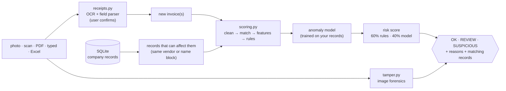

# How it works

For developers and reviewers. Usage is in the [README](../README.md).

## Flow

A **check** (`checks.check`) and a full **audit** (`checks.audit`) run the same scoring. A check loads only the
records that can change the new invoices' scores (same vendor ID, or the same 3-letter vendor-name block), which gives
the same result as scoring against everything. Measured on 100K records (laptop CPU): 0.5 s for one invoice, 3.5 s for a batch of 50, 7.5 s
for a full audit.

## Scoring (`engine/scoring.py`)

1. **Clean:** dates are parsed; amounts are converted to USD using the exchange-rate table (`data/exchange_rates.csv`, edited in the app; defaults
   in `config.USD_RATES`); vendor names are normalized: lower case, no punctuation, no bracketed registration numbers, no legal forms (`ACME Corp., LLC` → `acme`, `TRI SHAAS SDN BHD (728515-M)` → `tri shaas`). A currency without a rate is compared as-is, and
   the check's reasons say so.
2. **Near-duplicate matching:** invoices are grouped by the first 3 letters of the normalized vendor name, then sorted by
   amount. Candidate pairs have amounts within 0.5% (+0.01) and dates within 7 days. A candidate pair is confirmed when:
   - the vendor is the same and the invoice numbers are equal after removing dashes and spaces, or at least 85% similar (Levenshtein); or
   - the vendor names are at least 85% similar (0.4 × Levenshtein + 0.6 × Jaro-Winkler; at least 90% across different vendor IDs) **and** the
     invoice numbers are at least 70% similar.

   **Sequential numbers are not duplicates:** when two numbers differ only in their digits (`INV-0501` vs `INV-0502`), they
   must also share the date. A retyped copy keeps the document's date, while the vendor's next invoice (for example a weekly bill for the
   same amount) has a new one. Without this, 4,750 of 100,000 clean synthetic invoices were flagged; with it, 312 are (same vendor, same day, near-identical
   amount and number). On the real receipts it removed one false positive.

   The later invoice is the duplicate. In a check, the new invoice is always the duplicate.
3. **Features per vendor**, each against the vendor's *other* invoices: USD amount, robust z-score of the log amount, amount ÷ median,
   amount ÷ max, invoices in the same calendar month
   (`vendor_invoices_same_month`), days since the previous invoice, invoices with the same amount (`vendor_same_amount_count`).
   Duplicate similarity is deliberately *not* a model feature: the near-duplicate rule already scores it, and adding it to
   the model would count the same evidence twice.
4. **Rules:** see the table in the README. Each scores 0–1, and `rule_score` is the highest of them.

   **Overpayment** compares an invoice with the vendor's *other* invoices (it needs at least 3 of them):
   - **Leave-one-out:** an overpayment counted in its own baseline pulls the baseline toward itself. With the vendor's
     plain mean and standard deviation, a vendor needed about 14 invoices before any amount could reach 3.5 standard deviations.
   - **Log scale:** amounts vary by multiples. A supermarket bill of 5 or 500 is normal; a supplier that always bills about 1,000
     sending 3,000 is not. The score is a robust z-score, (log amount − median log amount) ÷ (1.4826 × MAD), so 3× means more for a steady vendor.
   - **Two tiers:** at least 3× the median and z ≥ 3.5 gives SUSPICIOUS. At least 2× and z ≥ 2.5 gives REVIEW.
5. **Anomaly model:** see below. `ml_score` is 0–1.
6. **Risk score:** `0.6 × rule_score + 0.4 × ml_score`. A rule hit ≥ 0.80 lifts it to at least 0.88. Scores ≥ 0.7 are
   **HIGH** (SUSPICIOUS) and ≥ 0.4 are **MEDIUM** (REVIEW). The model's maximum contribution is 0.4, so **the model alone can
   never make an invoice SUSPICIOUS**. An image-tamper flag alone only gives REVIEW.

## Anomaly model (Isolation Forest)

- **Why:** company histories are unlabelled, so nobody knows which past payments were wrong. Isolation Forest needs no labels, trains
  in seconds on 100K rows, and measures how quickly random splits isolate an invoice.
- **Training:** each audit refits it on all records: 7 standardized features, 200 trees, `random_state=42`. The forest scores the history once
  during training, and those scores are reused for the audit. The
  "unusual" cutoff marks the most unusual 1% of the history. That cutoff only adds a flag and a reason. It changes neither the score nor
  the verdict.
- **Not trained** on fewer than `MIN_RECORDS_FOR_MODEL` (50) records. With so little history it would learn noise, so
  checks use rules only until there is more.
- **Saved** as a plain dict (feature list, scaler, forest, cutoff, score range) in `models/anomaly.joblib`. That file is per company
  and is never committed. A model saved with a different feature list is ignored until the next audit.

## Image-tamper model (`engine/tamper.py`)

- **Data:** *Find it again!* has 988 real receipt scans, 163 of them forged, with official train/val/test splits (577/192/218).
  **The edited regions are marked**, which is what the model learns from.
- **Features, per 32×32 block with printed content (57 values):** error-level analysis at JPEG qualities 75, 90 and 95 (re-save, then diff),
  a noise residual (image minus its 3×3 median), an edge map, and gray level. Each is summarized as mean, std and max, then taken raw,
  relative to the whole receipt and relative to the 8 neighbouring blocks. A pasted digit stands out from the digits next to it.
- **Model:** gradient-boosted trees (`HistGradientBoostingClassifier`, 300 iterations, ≥ 50 blocks per leaf, L2 1.0, balanced classes)
  classify each block as edited or not. A receipt's score is its most suspicious block, and the app outlines that block for the reviewer.
- **Training** (`python cli.py train-tamper`): train+val. The threshold is the best F1 on 5-fold **out-of-fold** predictions, with folds
  split by receipt so blocks from one receipt never sit on both sides. The test split is used only for the final report.

| Model | Train ROC-AUC | CV ROC-AUC | Test ROC-AUC | Test precision | Test recall | Test F1 |
|---|---|---|---|---|---|---|
| Random forest on 17 whole-image numbers (first version) | **0.999** | 0.761 | 0.731 | 36.8% | 40.0% | 0.384 |
| Logistic regression on the same 17 numbers | 0.777 | 0.725 | 0.770 | 39.0% | 45.7% | 0.421 |
| Logistic regression on blocks | 0.888 | 0.870 | 0.850 | 53.3% | 45.7% | 0.492 |
| **Gradient boosting on blocks (shipped)** | 0.968 | 0.902 | **0.909** | **75.0%** | **68.6%** | **0.716** |

**Overfitting.** The first forest memorized its 769 training receipts: 0.999 on them, 0.73 on unseen receipts. Labelling blocks instead of
whole receipts gives 635,000 training examples, about 4,700 of them edited. The shipped model's cross-validated (0.902) and test (0.909) scores
agree, so the remaining train/test gap (0.968) is ordinary.

**Your answer key** (`data/samples/random_test`, 10 receipts from the test split): 9 of 10 correct, with 4 of 5 forgeries caught and no
genuine receipt flagged. The missed forgery scores 0.961, just under the 0.978 threshold.

**What else was tried.** An arithmetic check on the receipt text (CASH − CHANGE should equal TOTAL) was tested on the whole dataset.
Only 37% of receipts can be checked that way. Among those, 31% of forged receipts fail it, but so do 11% of genuine ones (mostly parse
noise), so its flags would be right about 35% of the time, so it was not added. A JPEG-grid feature also did not help.

**Limits.** All training receipts are Malaysian retail receipts scanned in one way. Other document types, phone photos and other
editing tools are untested. **PDFs are never tamper-scored:** rendering a page resamples it, which erases the traces the model reads.
A tamper flag gives REVIEW only.

## Evaluation honesty

- An earlier version reported 98.6% precision on 105K **synthetic** invoices. That claim was removed for two reasons: the anomalies were generated
  alongside the rules that detect them, and the evaluation threshold was tuned on the same labels it was scored on. The audit now
  evaluates at the fixed HIGH threshold only.
- **Benchmark on real data** (`python tests/benchmark.py`): 10-fold cross-validation on the 377 real receipts, end to end (import,
  audit, check). Negatives are held-out genuine receipts and the vendor's next bill. Positives are real records with real-world errors
  applied. The error types come from how duplicates arise, not from the rule thresholds. Flagged = SUSPICIOUS or REVIEW.

  | Case | Before | Now |
  |---|---|---|
  | Genuine receipt flagged (false positive) | 0.8% | 3.8% (2.1% SUSPICIOUS) |
  | Vendor's next bill flagged | 0.0% | 0.8% |
  | Exact copy / number retyped / OCR confusion / date shifted | 100% | 100% |
  | Vendor name written differently | 76.7% | 99.2% |
  | All errors combined | 75.0% | 99.2% |
  | Overpayment 10× / 5× / 3× / 2× | 18% / 15% / 0% / 0% | 38% / 33% / 17% / 5% |
  | Overpayment 10× / 5× / 3×, vendor has 10+ invoices | – | 49% / 44% / 18% |

  The old near-zero false-positive rate came from an overpayment rule that almost never fired. Retail receipts vary enormously within
  one shop, so overpayment recall on this data is a lower bound; steady supplier invoices make overpayments far easier to see.
- **Your batch answer key** (`data/samples/random_test`, 20 rows): 18 of 20 correct (was 16). Both misses are overpayments of 3.7× and 7.9× at shops whose
  own receipts already span about 10× and 90×.
- Accuracy on your own data needs labelled records: add an `is_anomaly` column (1 = known bad, plus an optional `anomaly_type`) to an
  import, and `python cli.py audit` reports precision, recall and recall per type.

## Receipts (`engine/receipts.py`)

- OCR uses RapidOCR (PP-OCR models on ONNX Runtime, CPU). Text boxes are regrouped into lines by vertical position, so that
  "TOTAL" and "12.50" end up on one line. PDFs use their text layer when it has at least 20 characters; otherwise their pages are OCR'd.
- The field parser is heuristic. **Vendor** is the top line that looks like a business name. **Invoice number** comes from labelled patterns, with dates rejected.
  **Date** is the first date found, day-first. **Total** is the largest amount on a "total" line, excluding subtotals and tax. **Currency** comes from symbols or codes.
  Every field lands in an editable form.

## Database (`engine/db.py`)

| Table | Contents | Written by |
|---|---|---|
| `invoices` | The company's records | import, "Add to company records" |
| `vendors` | Vendor IDs and names, used to map receipt names to IDs | import |
| `detection_results` | Last audit's scores per record (rebuilt each audit) | audit |
| `receipt_checks` | Every check and its verdict | app, `cli.py check` |

Schema defaults (currency `USD`, payment status `pending`) apply to columns an import file doesn't have. `db.connect` also drops
tables and indexes left by older versions.

SQLite (WAL mode) at `data/invoices.db`, or the path in the `INVOICE_DB_PATH` environment variable. Each browser session gets its own connection.
Backups use SQLite's online backup API (`db.backup`, `python cli.py backup`), so they are consistent while the app runs; the app also
backs up before each import. Access control is a single shared password (`INVOICE_APP_PASSWORD`), compared in constant time. There are no
individual accounts or roles. Encryption is left to HTTPS settings and disk encryption (see the README).

## Changing things

- **Thresholds:** edit `engine/config.py`. New checks pick the change up immediately; stored results update after the next audit.
- **New rule:** add it in `scoring.apply_rules` (one entry in the `rules` dict), add a reason in `checks._reasons`, and put its threshold in config.
- **New model feature:** compute it in `scoring.add_features`, add it to `FEATURES`, and re-run the audit.
- **Tests:** `python tests/test_engine.py` (run by GitHub Actions on every push). It covers the field parser, column matching, the template, and
  an audit plus checks: an exact duplicate, a reformatted duplicate, an overpayment, a normal invoice, a new vendor, a sequential
  next invoice, a misspelled vendor, a currency without a rate, schema defaults and backups.
  `python tests/benchmark.py [records.csv]` measures accuracy; re-run it after changing any threshold.
