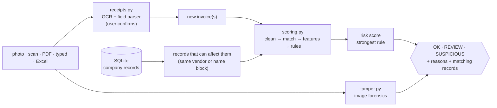

# How it works

For developers and reviewers. Usage is in the [README](../README.md).

## Flow

A **check** (`checks.check`) and a full **audit** (`checks.audit`) run the same scoring. A check loads only the
records that can change the new invoices' scores (same vendor ID, or the same 3-letter vendor-name block), which gives
the same result as scoring against everything. Before scoring, an audit merges vendor IDs the engine generated for one
company under two spellings (`importer.merge_split_vendors`): IDs created before name normalization improved split
four vendors' histories in the demo records, weakening their amount statistics and hiding duplicates between the IDs.
Only generated `V-...` IDs whose names now normalize identically are merged; IDs from the company's system are never touched. Measured with `python tests/speed.py` on 100K records from 2,000 vendors
(laptop CPU, two runs): 0.2–0.3 s for one invoice, 0.6–1.2 s for a batch of 50, 11–25 s for a full audit. A check slows
down when many vendors share the same first 3 letters, since they all land in one block (about 30 s with every vendor in one block).

## Scoring (`engine/scoring.py`)

1. **Clean:** dates are parsed; amounts are converted to USD using the exchange-rate table (`data/exchange_rates.csv`, edited in the app; defaults
   in `config.USD_RATES`); vendor names are normalized: lower case, no punctuation, no leading "the", no bracketed registration numbers, no legal forms (`ACME Corp., LLC` → `acme`, `TRI SHAAS SDN BHD (728515-M)` → `tri shaas`). A currency without a rate is compared as-is, and
   the check's reasons say so.
2. **Near-duplicate matching:** invoices are grouped twice, by the first 3 letters of the normalized vendor name (the same
   vendor under another ID) and by vendor ID (a name written differently), then sorted by amount. Candidate pairs have amounts within 0.5% (+0.01) and dates within 7 days. A candidate pair is confirmed when:
   - the vendor is the same and the invoice numbers are equal after removing dashes and spaces, or at least 85% similar (Levenshtein); or
   - the vendor names are at least 85% similar (0.4 × Levenshtein + 0.6 × Jaro-Winkler; at least 90% across different vendor IDs) **and** the
     invoice numbers are at least 70% similar.

   **Sequential numbers are not duplicates:** when two numbers differ only in their digits (`INV-0501` vs `INV-0502`), they
   must also share the date. A retyped copy keeps the document's date, while the vendor's next invoice (for example a weekly bill for the
   same amount) has a new one. Without this, 4,750 of 100,000 clean synthetic invoices were flagged; with it, 312 are (same vendor, same day, near-identical
   amount and number). On the real receipts it removed one false positive.

   The later invoice is the duplicate. In a check, the new invoice is always the duplicate.
3. **Amount statistics per vendor**, each against the vendor's *other* invoices: amount ÷ median, and the robust z-score of the
   log amount (below).
4. **Rules:** see the table in the README. Each scores 0–1.

   **Same number, new amount:** a later invoice with the same vendor and the same number (letters and digits only, so
   `INV-0012` = `INV 0012`) but a different amount scores 0.6, a REVIEW. Exact copies are caught by the exact-duplicate rule,
   and near duplicates allow only 0.5%, so a number re-billed with tax added or rounded up was never caught before. It is a
   review and not a hold because some vendors do reissue a number with a corrected amount.

   **Overpayment** compares an invoice with the vendor's *other* invoices (it needs at least 3 of them):
   - **Leave-one-out:** an overpayment counted in its own baseline pulls the baseline toward itself. With the vendor's
     plain mean and standard deviation, a vendor needed about 14 invoices before any amount could reach 3.5 standard deviations.
   - **Log scale:** amounts vary by multiples. A supermarket bill of 5 or 500 is normal; a supplier that always bills about 1,000
     sending 3,000 is not. The score is a robust z-score, (log amount − median log amount) ÷ (1.4826 × MAD), so 3× means more for a steady vendor.
   - **Two tiers:** at least 3× the median and z ≥ 3.5 gives SUSPICIOUS. At least 2× and z ≥ 2.5 gives REVIEW.
5. **Risk score:** the strongest rule's score. **HIGH** (≥ 0.8, SUSPICIOUS): exact or near duplicate, overpayment, burst.
   **MEDIUM** (≥ 0.4, REVIEW): possible overpayment, same number with a new amount, large round amount. An image-tamper flag
   alone only gives REVIEW.

## Removed: the anomaly model

Earlier versions blended an Isolation Forest (trained on the company's own records) into the score, 40% model and 60%
rules. Benchmarked with the model switched off, recall was identical on every case and genuine receipts flagged fell from
3.8% to 3.5%: it caught nothing the rules missed, and added training time, a saved per-company model and a vague reason
line ("among the most unusual 1%"). It was removed. Unsupervised scoring can come back when labelled company data
(`is_anomaly`) shows it adds something.

## Image-tamper model (`engine/tamper.py`)

- **Data:** *Find it again!* has 988 real receipt scans, 163 of them forged, with official train/val/test splits (577/192/218).
  **The edited regions are marked**, which is what the model learns from.
- **Features, per 32×32 block with printed content (57 values):** error-level analysis at JPEG qualities 75, 90 and 95 (re-save, then diff),
  a noise residual (image minus its 3×3 median), an edge map, and gray level. Each is summarized as mean, std and max, then taken raw,
  relative to the whole receipt and relative to the 8 neighbouring blocks. A pasted digit stands out from the digits next to it.
- **Model:** gradient-boosted trees (`HistGradientBoostingClassifier`, 300 iterations, ≥ 50 blocks per leaf, L2 1.0, balanced classes)
  classify each block as edited or not. A receipt's score is its most suspicious block, and the app outlines that block for the reviewer.
- **Training** (`python cli.py train-tamper`): train+val, each receipt twice: as scanned, and re-saved as a JPEG at a random quality
  from 85 to 95 (uploads are often JPEG; the dataset is lossless PNG). There are two thresholds, one for scans (0.956) and one for JPEGs
  (0.970), each the best F1 on 5-fold **out-of-fold** predictions, with folds split by receipt so no copy of one receipt sits on both sides.
  The test split is used only for the final report. The model, thresholds and the scikit-learn version that saved them are in
  `models/tamper.joblib`; the app warns when a different scikit-learn is installed.
- **JPEG uploads below quality 85** are not scored: the app reads the quality from the file's quantization table and says *not checked*.

| Model | Train ROC-AUC | CV ROC-AUC | Test ROC-AUC | Test precision | Test recall | Test F1 |
|---|---|---|---|---|---|---|
| Random forest on 17 whole-image numbers (first version) | **0.999** | 0.761 | 0.731 | 36.8% | 40.0% | 0.384 |
| Logistic regression on the same 17 numbers | 0.777 | 0.725 | 0.770 | 39.0% | 45.7% | 0.421 |
| Logistic regression on blocks | 0.888 | 0.870 | 0.850 | 53.3% | 45.7% | 0.492 |
| Gradient boosting on blocks, scans only (previous) | 0.968 | 0.902 | 0.909 | **75.0%** | 68.6% | **0.716** |
| **Gradient boosting on blocks, scans + JPEGs (shipped)** | 0.970 | 0.902 | **0.921** | 71.4% | **71.4%** | 0.714 |

**By upload format** (test split: 218 receipts, 35 forged). The scans-only model was trained on lossless PNG scans and fell apart on
JPEGs; adding JPEG copies to training fixed quality 90 without hurting scans. Neither model can do anything with strong compression
or downscaling:

| Upload | Scans-only model: caught / genuine flagged | Shipped model: caught / genuine flagged |
|---|---|---|
| Original scan (PNG) | 68.6% / 4.4% | 71.4% / 5.5% |
| JPEG quality 90 | 14.3% / 1.1% | **65.7%** / 5.5% |
| JPEG quality 75 | 2.9% / 1.6% | 2.9% / 0.5%: shown as *not checked* |
| Half size | 5.7% / 3.8% | 0.0% / 2.2%: can't be detected, documented |

Training on downscaled copies was also tried: test ROC-AUC at half size stayed at 0.54, while the extra noise lowered the shared threshold
and flagged 10% of genuine scans, so it was dropped.

**Overfitting.** The first forest memorized its 769 training receipts: 0.999 on them, 0.73 on unseen receipts. Labelling blocks instead of
whole receipts gives over a million training examples. The shipped model's cross-validated (0.902) and test (0.921) scores agree, so the
remaining train/test gap (0.970) is ordinary.

**Your answer key** (`data/samples/random_test`, 10 receipts from the test split): 9 of 10 correct, with 4 of 5 forgeries caught and no
genuine receipt flagged. The missed forgery scores 0.953, just under the 0.956 scan threshold.

**What else was tried.** An arithmetic check on the receipt text (CASH − CHANGE should equal TOTAL) was tested on the whole dataset.
Only 37% of receipts can be checked that way. Among those, 31% of forged receipts fail it, but so do 11% of genuine ones (mostly parse
noise), so its flags would be right about 35% of the time, so it was not added. A JPEG-grid feature also did not help.

**Limits.** All training receipts are Malaysian retail receipts scanned in one way. Other document types, real phone photos (as
opposed to re-saved scans) and other editing tools are untested. Downscaled images can't be judged and can't be recognized as downscaled. **PDFs are never tamper-scored:** rendering a page resamples it, which erases the traces the model reads.
A tamper flag gives REVIEW only.

## Evaluation honesty

- An earlier version reported 98.6% precision on 105K **synthetic** invoices. That claim was removed for two reasons: the anomalies were generated
  alongside the rules that detect them, and the evaluation threshold was tuned on the same labels it was scored on. The audit now
  evaluates at the fixed HIGH threshold only.
- **Benchmark on real data** (`python tests/benchmark.py`): 10-fold cross-validation, end to end (import, audit, check), on the
  genuine receipts of the public *Find it again!* dataset as `python cli.py demo` loads them (534 records; downloaded once), so the
  numbers can be reproduced from the repo. Negatives are held-out genuine receipts and the vendor's next bill (skipped when that
  next number is itself a real receipt). Positives are real records with real-world errors applied. The error types come from how
  duplicates arise, not from the rule thresholds. Flagged = SUSPICIOUS or REVIEW.

  | Case | 377 records, issue 1 rules | 377 records, now | 534 demo records, now |
  |---|---|---|---|
  | Genuine receipt flagged (false positive) | 3.8% (2.1% SUSPICIOUS) | 4.0% (2.1%) | 5.3% (2.6%) |
  | Vendor's next bill flagged | 0.8% | 2.5% | 2.5% |
  | Exact copy / number retyped / date shifted | 100% | 100% | 100% |
  | OCR confusion in number | 100% | 100% | 98.3% |
  | Vendor name written differently | 99.2% | 99.2% | 96.7% |
  | "The" + name, number retyped | 0% | 100% | 98.3% |
  | All errors combined | 99.2% | 99.2% | 96.7% |
  | Same number, +6% (tax) / rounded up | 0% / 0% | 100% / 99.2% | 98.3% / 98.3% |
  | Overpayment 10× / 5× / 3× / 2× | 38% / 33% / 17% / 5% | 38% / 33% / 17% / 5% | 53% / 40% / 26% / 13% |
  | Overpayment 10× / 5× / 3×, vendor has 10+ invoices | 49% / 44% / 18% | 49% / 44% / 18% | 73% / 64% / 39% |

  The 377 records were loaded with the old parser and are not in the repo; the 534 are what the current parser reads from the same
  dataset (more invoice numbers found). Most of the extra genuine flags on the 534 are real ambiguities the old parser never saw: parking
  tickets with sequential numbers, all on one day for the same 6.00. Retail receipts vary enormously within one shop, so overpayment recall
  on this data is a lower bound; steady supplier invoices make overpayments far easier to see.
- **Your batch answer key** (`data/samples/random_test`, 20 rows): 18 of 20 correct (was 16). Both misses are overpayments of 3.7× and 7.9× at shops whose
  own receipts already span about 10× and 90×.
- Accuracy on your own data needs labelled records: add an `is_anomaly` column (1 = known bad, plus an optional `anomaly_type`) to an
  import, and `python cli.py audit` reports precision, recall and recall per type.

## Receipts (`engine/receipts.py`)

- OCR uses RapidOCR (PP-OCR models on ONNX Runtime, CPU). Text boxes are regrouped into lines by vertical position, so that
  "TOTAL" and "12.50" end up on one line. PDFs use their text layer when it has at least 20 characters; otherwise their pages are OCR'd.
- The field parser is heuristic. **Vendor** is the top line that looks like a business name, skipping address, phone and
  registration lines. **Invoice number** comes from labelled patterns, with dates rejected: the document's own number
  (invoice, receipt, bill, doc) before order, slip or terminal numbers, with the label and number allowed on separate lines.
  **Date** is the first date found, day-first. **Total** is the largest amount on a "total" line, excluding subtotals and tax. **Currency** comes from symbols or codes.
  Every field lands in an editable form.

## Database (`engine/db.py`)

| Table | Contents | Written by |
|---|---|---|
| `invoices` | The company's records | import, "Add to company records" |
| `vendors` | Vendor IDs and names, used to map receipt names to IDs | import, audit (merges split IDs) |
| `detection_results` | Last audit's score, tier and flags per record (rebuilt each audit) | audit |
| `receipt_checks` | Every check, its verdict and who ran it (`checked_by`) | app, `cli.py check` |

Schema defaults (currency `USD`, payment status `pending`) apply to columns an import file doesn't have. `db.connect` also drops
tables and indexes left by older versions.

SQLite (WAL mode) at `data/invoices.db`, or the path in the `INVOICE_DB_PATH` environment variable. Each browser session gets its own connection.
Backups use SQLite's online backup API (`db.backup`, `python cli.py backup`), so they are consistent while the app runs; the app also
backs up before each import. Access control is a single shared password (`INVOICE_APP_PASSWORD`), compared in constant time. There are no
individual accounts or roles: `checked_by` is the name typed in the app's sidebar (unverified), or the OS user for `cli.py check`. Encryption is left to HTTPS settings and disk encryption (see the README).

## Changing things

- **Thresholds:** edit `engine/config.py`. New checks pick the change up immediately; stored results update after the next audit.
- **New rule:** add it in `scoring.apply_rules` (one entry in the `rules` dict), add a reason in `checks._reasons`, and put its threshold in config.
- **Tests:** `python tests/test_engine.py` (run by GitHub Actions on every push). It covers the field parser (including receipt layouts
  that used to hide the invoice number), date-order detection, CSV formula escaping, column matching, the template, and an audit plus
  checks: an exact duplicate, a reformatted duplicate, "The" + name with a retyped number, the same number with a new amount, an
  overpayment, a normal invoice, a new vendor, a sequential next invoice, a misspelled vendor, a currency without a rate, re-importing
  a file, merging split vendor IDs, the check log, schema defaults and backups. `python tests/test_receipts.py` (also in CI) runs OCR,
  the parser and the tamper model on 4 real receipts from the dataset's test split (`tests/fixtures/`, 2 genuine, 2 forged) and checks
  the fields read, the tamper verdicts, and that a quality-75 JPEG is reported as not checked.
  `python tests/benchmark.py [records.csv]` measures accuracy; re-run it after changing any threshold.
