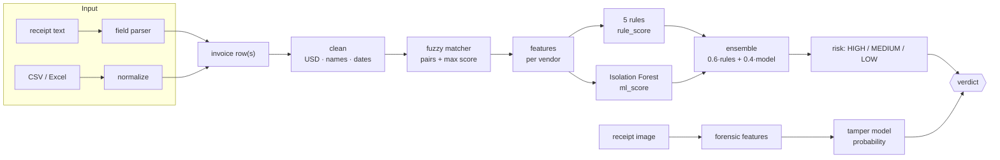

# Models and detection logic

The engine combines **deterministic rules** with **two trained models** and one **pre-trained OCR model**. No large
language models, embeddings or external AI services are used, so there is no prompt, hallucination or data-sharing
risk; the risks are the classic ones of small tabular/image models (listed per component).

| Component | Type | Trained on | Where |
|---|---|---|---|
| Fuzzy matcher | Deterministic string similarity | — | `matching/fuzzy_matcher.py` |
| Business rules | Deterministic thresholds | — | `detection/rule_engine.py` |
| Anomaly model | Isolation Forest (unsupervised) | **Each company's own records**, at audit time | `detection/ml_detector.py` |
| Ensemble | Weighted blend + thresholds | — | `detection/ensemble.py` |
| Image-tamper model | Random forest on 17 forensic features (supervised) | *Find it again!* receipts (988 real scans, 163 forged) | `forgery/` |
| OCR | PP-OCRv6 small detection/recognition (ONNX), via RapidOCR | Pre-trained, shipped with the `rapidocr` package | `intake/ocr.py` |

---

## 1. End-to-end pipeline

**Verdict logic** (`detection/checker.verdict`): HIGH → **SUSPICIOUS**; MEDIUM, or tamper flag → **REVIEW**;
otherwise **OK**. A tamper flag can never produce SUSPICIOUS on its own (see §5 for why).

---

## 2. Features (`preprocessing/feature_engineer.py`)

Computed per invoice relative to **its vendor's** history (grouped by `vendor_id`):

| Feature | Meaning | Used by |
|---|---|---|
| `amount_usd` | Amount converted to USD (USD/EUR/GBP; other currencies unchanged) | model |
| `amount_zscore` | Standard deviations from the vendor's mean | rule 3, model |
| `amount_to_vendor_median` | Amount ÷ vendor median | rules 3 & 5, model, reasons |
| `amount_to_vendor_max` | Amount ÷ vendor maximum | model |
| `vendor_invoice_count_30d` | Vendor invoices in the same **calendar month** (name kept for compatibility) | model |
| `days_since_last_invoice` | Gap to the vendor's previous invoice (999 for the first) | model |
| `same_amount_count_30d` | Vendor invoices with the same amount (rounded to 0.1) over **all time** (name kept for compatibility) | model |
| `max_fuzzy_score` | Best near-duplicate similarity where this invoice is the duplicate | model |

---

## 3. Deterministic detection

**Fuzzy matcher.** Blocks invoices by the first `BLOCKING_KEY_LENGTH` (3) letters of the cleaned vendor name; within a
block, sorts by amount and pairs invoices within `NEAR_DUP_AMOUNT_TOLERANCE` (0.5% + 0.01) and
`NEAR_DUP_DATE_WINDOW_DAYS` (7). A candidate pair is a confirmed near-duplicate if any holds:
- same vendor and invoice numbers equal after removing dashes/spaces;
- same vendor and invoice-number similarity ≥ `INVOICE_ID_MATCH_THRESHOLD` (0.85, Levenshtein ratio);
- vendor-name similarity ≥ `FUZZY_THRESHOLD` (0.85; ≥ 0.90 across different vendor IDs), name similarity =
  0.4 × Levenshtein + 0.6 × Jaro-Winkler, **and** invoice-number similarity ≥ `INVOICE_ID_SUPPORT_THRESHOLD` (0.70).

**Rules** (score 0–1; `rule_score` = the maximum):

| Rule | Fires when | Score |
|---|---|---|
| Exact duplicate | Same vendor ID + invoice number + USD amount as an earlier row | 1.0 |
| Near duplicate | Invoice is the duplicate side of a confirmed fuzzy pair | pair similarity (≥ 0.85) |
| Overpayment | amount ≥ 3 × vendor median **and** z-score ≥ 3.5 | max(0.85, (ratio − 1) / 5) |
| Burst | ≥ 3 invoices with the same vendor, PO number and date | 0.90 |
| Round number | ≥ 25,000, multiple of 5,000, ≥ 2.5 × vendor median | 0.65 |

All thresholds live in `config.py`.

---

## 4. Anomaly model (Isolation Forest)

**Why this model.** Company payment histories are unlabelled: nobody has a list of which past payments were wrong.
Isolation Forest needs no labels, handles mixed-scale tabular features after standardization, trains in seconds on
100K rows on a CPU, and saves to a ~2 MB file. It measures how quickly random splits isolate a point; unusual
invoices are isolated in fewer splits.

**Training** (`python pipeline.py` / sidebar button → `MLDetector.fit`):
1. Build the 8-feature matrix for all records, standardize (`StandardScaler`).
2. Fit 200 trees (`ISOLATION_FOREST_N_ESTIMATORS`), `random_state=42`.
3. Score all records once; set the flag cutoff so `ISOLATION_FOREST_CONTAMINATION` (1%) of the history is flagged.
4. Store the scaler, forest, cutoff and the min/max of training scores in `models/anomaly.joblib`.

**Inference** (`MLDetector.score`, used by checks): same features, fitted scaler, `score_samples`; `ml_score` is
rescaled to 0–1 against the training range (higher = more unusual; values beyond the training range are clipped).

**How it affects outcomes.**
- `ml_score` contributes 40% of `final_score`. Its maximum contribution (0.40) reaches MEDIUM, so **the model alone can
  produce REVIEW but never SUSPICIOUS.**
- The 1% flag only adds the `ml_isolation_forest` flag and the reason *"Among the most unusual 1% of past payments"*.
  It does not change scores or verdicts. (It was 6.5% before; on the 105K benchmark that flagged 6,824 invoices;
  1% flags 1,050, with identical scores and verdicts. sklearn's `"auto"` cutoff was tried and flagged 11.6%.)

**Limitations.** Trained per company, so it only knows that company's normal; a brand-new vendor has no history, so
its features are degenerate (flagged more often, and the reasons also say "new vendor"). It is refitted, not updated
incrementally; stale until the next audit.

---

## 5. Image-tamper model

**Goal.** Flag receipt images whose pixels suggest editing (a retyped total, pasted digits), for a human to look at.

**Dataset.** *Find it again!* (ICDAR 2023, L3i, University of La Rochelle): 988 real scanned receipts from the SROIE
collection with transcriptions, 163 realistically forged, with official train/val/test splits
(577 / 192 / 218 images; one validation image listed in `val.txt` is missing from the archive and skipped).
Downloaded once with 32 parallel byte-range connections (the host throttles per connection) into
`~/.cache/invoice-engine`. Published for research; see the licence note in the README.

**Features** (`forgery/model.py`, 17 values per image). Classical document forensics:
- **Error-level analysis (ELA):** re-save as JPEG (quality 90) and take the absolute difference; regions edited after
  the original compression respond differently.
- **Noise residual:** image minus its 3×3 median filter; pasted content often carries different sensor/print noise.
- Both maps are summarised per 32×32 block **over text blocks only** (grayscale std > 12, blank paper excluded): mean,
  std, median, 95th percentile, max, max/median ratio, share of blocks above median + 4·MAD. Plus text-block share,
  global ELA mean and global noise mean.

**Training** (`python -m forgery.train`): features extracted in parallel and cached; random forest (500 trees,
`min_samples_leaf=2`, balanced class weights) and histogram gradient boosting compared on **validation** ROC-AUC
(0.751 vs 0.734); decision threshold = best F1 on validation (0.316); test split used only for the final report.

**Results (held-out test split, 218 receipts, 35 forged).**

| Split | ROC-AUC | Precision | Recall | F1 |
|---|---|---|---|---|
| Validation | 0.751 | 45.2% | 42.4% | 0.438 |
| **Test** | **0.735** | **36.8%** | **40.0%** | **0.384** |

About 4 in 10 forged receipts are flagged; about 1 in 3 flags is a real forgery.

**Overfitting check.** Train ROC-AUC is 0.999, so the forest memorises its training set. More regularised forests
(`min_samples_leaf` 10 or 20, depth 6) and logistic regression score the same on unseen data (test 0.72–0.75, 5-fold
cross-validation 0.73–0.77 ± 0.04–0.07). The ceiling is the feature set and the ~160 forged examples, not overfitting.
An added JPEG-grid feature did not improve validation and was not kept.

**Safeguards.**
- A tamper flag gives **REVIEW** only, never SUSPICIOUS.
- **PDFs are not tamper-scored.** Rendering a PDF page resamples it, which erased the traces the model reads and
  produced false flags in testing (an untouched receipt scored 4% as an image, 33% as a PDF).
- The app shows the probability, not just a yes/no.

---

## 6. OCR and field extraction

- **OCR** (`intake/ocr.py`): RapidOCR with its bundled PP-OCRv6 small detection and recognition models on ONNX Runtime,
  CPU only. Text boxes are regrouped into lines by vertical position so "TOTAL" and "12.50" end up on one line. PDFs use
  their text layer when it has ≥ 20 characters, otherwise pages are rendered at 2× and OCR'd.
- **Field parser** (`intake/fields.py`): heuristics, not a model.
  - vendor: first top line that looks like a business name (SDN BHD, LTD, ENTERPRISE, TRADING, MART…), else the first
    line with words; skips headings and registration/GST/phone lines;
  - invoice number: labelled patterns (`Invoice No`, `Receipt #`, `Doc No`, `CS…`), rejecting values that are dates;
  - date: several formats, day-first by default; amount: largest value on a "total"-type line (subtotals/tax excluded),
    else the largest amount; currency from symbols/codes.
- **Fallback:** every extracted field lands in an editable form; the user confirms before any check runs.
- **Speed:** about 7–15 s per receipt photo on a laptop CPU, plus ~20–30 s once per process to load the engine.

---

## 7. Evaluation methodology and honesty notes

| Claim | Evidence | Caveat |
|---|---|---|
| Rules + model: 98.6% precision, 96.5% recall | Labelled benchmark of 104,983 invoices with 5,758 planted anomalies | **Optimistic:** anomalies were generated alongside the rules (e.g. overpayments planted at 3.5–6.5×, rule fires at 3×). The generator has since been removed |
| Real receipts | 377 genuine receipts loaded as history: 6 flagged HIGH, 4 of them the same receipt recorded twice | Too few real problems to compute accuracy |
| Tamper model: test ROC-AUC 0.735 | Held-out official test split | Small dataset; Malaysian retail receipts only |
| Refactors preserve results | Every behaviour-preserving change was checked by re-running the 105K benchmark and comparing scores row by row | — |

Real-world accuracy needs a labelled sample of the company's own payments (`is_anomaly` column); the audit then
reports precision/recall automatically.

---

## 8. Extending

- **Add a rule:** new method in `RuleEngine`, add it in `apply_all_rules` (column + `names` map), a threshold in
  `config.py`, a reason in `checker._reasons`.
- **Add a model feature:** compute it in `feature_engineer.py`, add the name to `MLDetector.FEATURE_COLUMNS`, re-run the
  audit (old `anomaly.joblib` files become incompatible).
- **Improve tamper detection:** more forged training data is the biggest lever; content checks (line items summing to
  the total) and a CNN are the natural next steps.
