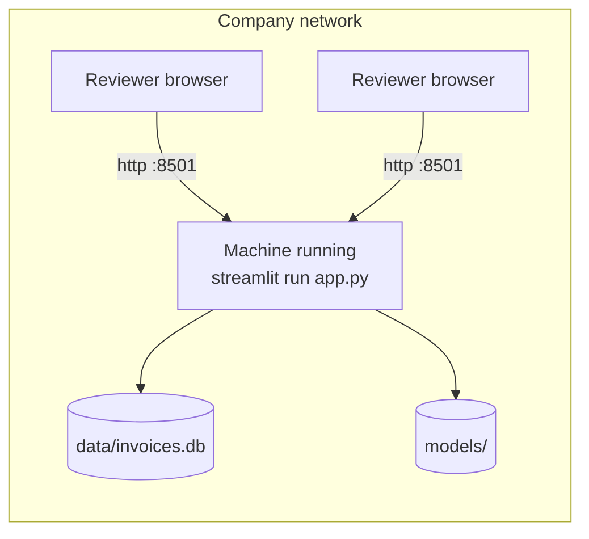

# Operations: install, deploy, secure, test, run

---

## 1. Installation

**Prerequisites:** Python 3.10+ (developed on 3.14), ~1.5 GB disk for dependencies. No system packages on
Windows/macOS; on Linux the OCR runtime needs `libgl1` and `libglib2.0-0` (listed in `packages.txt`).

```bash
git clone https://github.com/TusharParlikar/Invoice-Overpayment-Duplicate-Payment-Detection-Engine.git
cd Invoice-Overpayment-Duplicate-Payment-Detection-Engine
python -m venv .venv && . .venv/bin/activate      # Windows: .venv\Scripts\activate
pip install -r requirements.txt
python tests/test_core.py                         # expect three "ok" lines
```

Then load data and start (see the README Quick start): import records → `python pipeline.py` →
`python -m streamlit run app.py`.

### Troubleshooting

| Symptom | Cause | Fix |
|---|---|---|
| `streamlit: command not found` | Scripts folder not on PATH (common on Windows) | Use `python -m streamlit run app.py` |
| `ImportError: libGL.so.1` (Linux) | OpenCV runtime libraries missing | `apt install libgl1 libglib2.0-0` |
| First photo check takes 20–30 s | OCR engine loads once per process | Normal; later photos take ~7–15 s |
| "Missing required column(s)" on import | Headers not recognized | Rename to e.g. `Invoice No`, `Vendor`, `Date`, `Amount`, or add an alias in `intake/importer.py` `ALIASES` |
| Dates imported wrong (e.g. 03/04 as March 4) | Ambiguous format | Re-import with `--dayfirst` (or tick it in the app) |
| Every checked vendor shows "New vendor" | No records imported, or names too different | Import history; include a vendor ID column |
| Sidebar says anomaly model not trained | No audit run yet | `python pipeline.py` or the sidebar button |
| Tamper probability "n/a" | PDF input (by design), or `models/tamper.joblib` missing | Upload an image; or `python -m forgery.train` |
| Import fails on an old database (`NOT NULL constraint failed: invoices.due_date`) | Database created by an earlier schema version | See [DATABASE.md §8](DATABASE.md#8-schema-changes-and-migrations): migrate or start a new file |
| `database is locked` | Two writes at once (audit + import) | Retry; avoid concurrent audits |
| Dataset download very slow | Host throttles each connection (~50 KB/s) | Already parallel (32 connections); ~15–20 min total |
| Large files in a OneDrive/Dropbox folder vanish or truncate | Sync client interference | Keep `INVOICE_DB_PATH` and `INVOICE_DATA_DIR` outside synced folders |

---

## 2. Deployment

| Environment | How | Data persistence | Use for |
|---|---|---|---|
| **Local / company machine** (recommended) | `python -m streamlit run app.py`; colleagues open `http://<machine>:8501` on the same network | SQLite file on that machine | Real invoices |
| **Streamlit Community Cloud** (free) | share.streamlit.io → Create app → this repo, `app.py`, Python 3.12; `requirements.txt` + `packages.txt` are picked up | **Lost on restart/redeploy** (ephemeral disk) | Public demo with sample data |
| Staging / production with hosted Postgres | Not implemented (planned) | — | Multi-user cloud use |

There is no Dockerfile, CI/CD pipeline, domain or TLS configuration in the repository.



Exposing the app beyond a trusted network requires login and HTTPS first (see §3).

---

## 3. Security and privacy

| Area | Current state | Risk | Mitigation / recommendation |
|---|---|---|---|
| Authentication / authorization | **None.** Anyone who can reach the port can check, import and view all records | Data exposure | Run inside a trusted network only; add login (Streamlit OIDC `st.login`) before any wider exposure |
| Roles | None | — | Planned with login (viewer vs importer/admin) |
| Sensitive data | Vendor names, invoice numbers, dates, amounts (confidential business data) in SQLite; receipt images processed **in memory only** (not saved); OCR text shown in the session only | Disclosure | File permissions on the database; no public deployment with real data |
| Encryption | None at rest (plain SQLite file), none in transit (HTTP) | Local file access, network sniffing | Full-disk encryption; reverse proxy with HTTPS (e.g. Caddy) |
| Secrets | None used (no API keys, no credentials) | — | If Postgres is added: env vars / Streamlit secrets, never committed |
| Input validation | Required fields and types validated on import and in the form; SQL fully parameterized; uploads limited to image/PDF/CSV/Excel types; Streamlit's default 200 MB upload limit and XSRF protection | Malformed files may raise errors | — |
| Model files | Loaded with `joblib` (pickle), which can execute code | A replaced model file could run arbitrary code | Only load models you built or trust; keep `models/` write-protected |
| Third parties | No runtime calls to external services. One-time dataset download from `l3i-share.univ-lr.fr` during training/demo setup | — | — |
| Cloud sync | If the project is in OneDrive/Dropbox, the database is copied to that cloud | Unintended data location | Set `INVOICE_DB_PATH` outside synced folders |
| Rate limiting | None | Resource exhaustion on a shared deployment | Reverse proxy limits if exposed |

**Retention:** records and the check log are kept indefinitely; there is no deletion feature. Define a retention
period with the company and delete via SQL until one exists. Payment records are often subject to the company's own
statutory retention rules; that is a company policy decision, not something the tool enforces.

---

## 4. Testing

| Layer | What | Command |
|---|---|---|
| Unit | Field parser (two real receipt layouts), column mapping (aliases, currency symbols, skipped rows) | `python tests/test_core.py` |
| Integration | Import → check on a temp database: exact copy, reformatted copy, 5× overpayment, normal invoice, new vendor | same |
| Regression (manual) | Re-run the 105K labelled benchmark and compare every score with the previous run; used for every behaviour-preserving change | Requires the benchmark CSV (generator removed; not in the repo) |
| ML evaluation | Tamper model validation/test metrics | `python -m forgery.train` |
| UI smoke (manual) | Streamlit `AppTest`: app loads; manual-entry check shows the verdict | ad hoc |

**Gaps:** no CI; no automated UI tests; no OCR tests on real images in the suite; the Excel path and
`add_to_records` are exercised only manually; the regression benchmark is not reproducible from the repo.

---

## 5. Observability

| Signal | Where |
|---|---|
| Logs | Python `logging` at INFO from pipeline stages (rule counts, fuzzy summary, model flag rate); printed to the console running the app/CLI |
| Health check | Streamlit's built-in `GET /_stcore/health` → `ok` |
| Audit trail | `receipt_checks` table: every check with inputs, scores and verdict |
| Model age | Sidebar shows when the anomaly model was trained |

No metrics backend, tracing or alerting exists. Worth monitoring in production:
- share of checks by verdict (a sudden rise in SUSPICIOUS/REVIEW suggests data or config problems);
- check latency and OCR latency;
- anomaly model age vs. last import (stale model);
- import skipped-row counts (export format drift);
- tamper flag rate (on the test set, where 16% of receipts were forged, the model flagged about 1 in 6 images;
  a much higher rate on real uploads suggests scans that differ from the training data).

---

## 6. Performance and scalability

Measured on a laptop CPU (12 threads):

| Operation | Size | Time |
|---|---|---|
| Full audit | 104,983 invoices, 2,500 vendors | ~10–15 s (load 1.7 s, fuzzy 1.1 s, model 3.9 s) |
| Import | 105K rows | ~8 s |
| Check one invoice | against 105K records | ~2.5 s (relevant-history subset; full history would be ~8.7 s) |
| OCR | one receipt photo | ~7–15 s (+ ~20–30 s engine load once per process) |
| Tamper features | one receipt | 0.1–0.6 s |
| Anomaly model load | first use per process | a few seconds (scikit-learn import); cached afterwards |

**Bottlenecks and how they evolve**
- **OCR is the slowest step.** Options: GPU ONNX runtime, smaller images, or queueing batch uploads.
- **Audit loads all records into memory.** Fine to a few million rows; beyond that, per-vendor batching is needed
  (the rules and features are per-vendor, so the work partitions naturally).
- **Fuzzy matching** is O(block size × window) in a Python loop; very large vendor blocks (thousands of invoices with
  near-identical amounts) are the worst case.
- **SQLite single writer** limits concurrent imports/audits; the Postgres plan addresses multi-user writes.
- **Horizontal scaling** is not supported yet (state in a local file and local model files).

Caching in place: OCR engine (per process), tamper model (per process), anomaly model (per process, reloaded when the
file changes), vendor-name normalization (per process).

---

## 7. Reliability and failure handling

| Failure | Behaviour |
|---|---|
| OCR finds no text / wrong fields | Empty or partly filled form; user types/corrects fields before checking |
| PDF without a text layer | Pages rendered and OCR'd |
| Missing required columns in an import | Nothing imported; message lists the columns found |
| Rows with unreadable amount/date or blank ID/vendor | Skipped with a count; others imported |
| No anomaly model yet | Checks run with rules only (`ml_score = 0`); sidebar says so |
| No tamper model | Tamper shown as "n/a"; record checks unaffected |
| Empty company history | Every vendor is "new"; only exact/near duplicates within the batch are found |
| Database write fails mid-audit | Transaction rolled back; previous results kept |
| Import fails after vendors were inserted | Unused vendor rows remain; invoices all-or-nothing |
| Dataset download interrupted | Each of 32 chunks retries up to 20 times and resumes from its last byte; the zip is validated before use |
| Dataset label lists a missing image | Skipped (one known case in the validation split) |

There are no retries or timeouts around database calls beyond SQLite's 5-second busy timeout, and no circuit breakers
(no external services are called at runtime).
